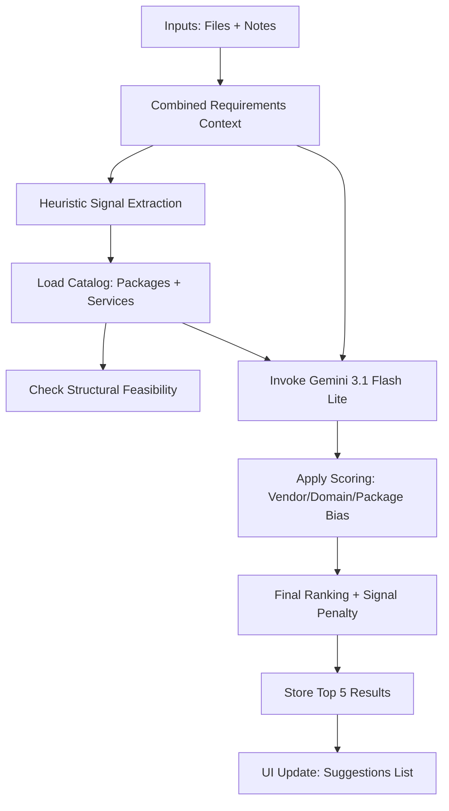

<!-- [MermaidChart: f9d11d27-1c85-4df3-8be5-309263f35035] -->
<!-- [MermaidChart: f9d11d27-1c85-4df3-8be5-309263f35035] -->
# Requirements Analysis Feature: Deep-Dive Mapping

This document provides a comprehensive technical mapping of the **Analyze Requirements** feature in the Zippy platform. It details how the system ingest, processes, and recommends catalog items using a combination of heuristic "Requirement Signals" and the Google Gemini AI engine.

---

## 1. Input Data & Aggregation
The feature combines multi-source inputs into a single "Context Block" before processing:

| Input Source | Collection Logic |
| :--- | :--- |
| **Manual Notes** | Captured from the `SA Additional Notes` textarea in the UI. |
| **Uploaded Documents** | Text extracted from PDFs/Word docs (via `extractedText` in `ProjectRequirementDocument`). |
| **Project Context** | Project name, customer name, and existing raw requirements. |

**Aggregation Strategy:** Text is joined with double-newlines. Document metadata (filenames/types) is prepended to provide the AI with source context.

---

## 2. The Processing Engine (Two-Stage Analysis)

### Stage 1: Heuristic "Signal" Parsing
Before hitting the AI, `src/lib/requirement-signals.ts` extracts structured architectural signals:
- **Site Count:** Regex-based detection (e.g., "50 sites").
- **Topology:** Identifies `full_mesh` or `hub_spoke`.
- **Breakout:** Identifies `local`, `backhaul`, or `split_tunnel`.

### Stage 2: AI Semantic Matching (Gemini)
The system invokes the Gemini API (Primary: **`gemini-3.1-flash-lite-preview`** | Fallback: **`gemini-2.5-flash`**).

#### Scoring & Logic Rules
The AI is provided with a system prompt that enforces specific business rules:
1. **Package Preference:** If a `PACKAGE` and a `MANAGED_SERVICE` both meet requirements, the **Package** must be scored higher.
2. **Vendor Preference:** If a customer mentions a vendor (e.g., "Meraki", "Cisco Catalyst"), the AI boosts aligned items and penalizes competitors.
3. **Domain Coverage:** Items covering multiple required domains (SD-WAN, LAN, WLAN, Security, etc.) score higher.
4. **Risk Assessment:** Any conflict between a candidate's `Constraints` or `Assumptions` and the user's requirements triggers a score reduction and a `riskFactor` note.

---

## 3. Package vs. Service: Differential Treatment
The system is architected to prioritize pre-architected packages over standalone components.

| Feature | Packages | Managed Services |
| :--- | :--- | :--- |
| **Data Provided to AI** | Full composition (sub-items), hardware details, and design policies. | Basic attributes, description, and features only. |
| **Signal Validation** | **Mandatory.** If a package violates a topology signal, it gets a **20% score penalty**. | **N/A.** Services are treated as building blocks that don't enforce topology. |
| **UI Diversity Mix** | Guaranteed **Top 2** slots in the recommendations list. | Guaranteed **Top 3** slots after the initial packages. |

---

## 4. Ranking & Normalization
The raw AI score (0-1) undergoes post-processing in `src/lib/recommendation-engine.ts`:

1. **Clamping:** AI scores are forced into a `[0, 1]` range.
2. **Structural Penalty:** If `type == PACKAGE` AND `signalFeasible == false`, the score is multiplied by **0.8**.
3. **Confidence Bounding:** The score is converted to a "Certainty Percentage" using a bounded exponential decay function: 
   `certainty = 1 - exp(-score * 2.2)`
   This ensures that only very strong matches reach the 90%+ certainty tier.

---

## 5. Persistence & Workflow Integration
Upon completion of a successful analysis:
1. **Clearance:** All previous `ProjectRecommendation` records for the project are deleted.
2. **Snapshot:** A `ProjectRecommendationRun` is created to log the model version, run ID, and timestamp for auditability.
3. **Workflow Change:** The project status advances to `RECOMMENDATIONS_READY`.
4. **Event Logging:** A system event is recorded for analytics, tracking which SA ran the analysis and what the top-scoring item was.

---

## 6. Execution Flow Summary

